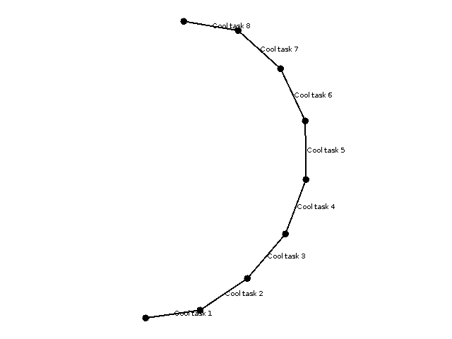

# Event Meshinery

This framework is a state store independent event framework and designed to easily structure long running, multi step,
processing tasks in a transparent way and safe way. The underlying state stores can be exchanged and combined to suit
your needs:

* Read from a mysql db, and write to kafka.
* Join Kafka messages from a Kafka topic with mysql db tables.
* Define a multistep processing pipeline and be able to (re)start the processing from any 'checkpoint'.

This framework was originally written to replace KafkaStreams in a specific usecase, but you can use this framework
without Kafka. Currently supported are the following state stores, but you can easily provide your own:

* Apache Kafka
* MySql
* Memory

## Meshinery vs KafkaStreams

Doing long running (blocking) calls (like rest) via Kafka Streams represents a challenge as this blocks a single thread
in the Kafka Streams framework from processing other messages and a single partition from getting processed:

**If you block a partition with a long running call, then you cannot process any other messages from this partition
until the processing is unblocked.**

This means that you can only scale in Kafka Streams as far as your Kafka Cluster (Partition count) allows:
If your Kafka Cluster has 32 Partitions per topic, you can only have a max number of 32 running threads and can only run
32 stream processors/message processing in parallel.

To solve this problem, the Event-Meshinery framework removes a guarantee:

**Messages are not processed in a partition in order, but processed as they arrive.**

This is possible if your events are completely independent of each other and it doesnt matter if you process message B
before message A, even if it is stored in the same partition.

## Advantages

* This framework lets you structure your code in a really transparent way by providing a state store independent api
* You separate the business layer from the underlying implementation layer
* You can resume a process in case of error and you will start exactly where you left off
* Fine granular configs for your thread management
* Fast time-to-market: switching between state stores is super easy: Start with memory for fast iteration cycles, if you
  need more guarantees switch to mysql or kafka without much work
* Easily integrated (using Spring or by constructing everything by hand)
* Create a complete event diagram to map your events and how they interact with each other (see "Draw the Graph")

## Draw the Graph

This framework provides you with the possibility to draw graph diagrams! Provide a list of tasks to the
MeshinaryDrawer.start() method and it returns a byte[] stream of a png. This is done
via  [GraphStream](https://graphstream-project.org/) and you can even style them by yourself.

## Architecture

The building blocks of this framework consists of 4 basic classes:

* MeshineryTask
* MeshineryProcessor
* RoundRobinScheduler
* Input/OutputSources

### MeshineryTasks

MeshineryTask describes a single **business** unit of work, which consists of an input source ,
a list of processors to solve a part of the business logic and one or
multiple output calls. An input source takes an eventkey/id, which gets fed to the inputsource to produce data. This
data is fed to the processors and multiple output sources, which spawn more events.

    var meshineryTask = MeshineryTask.<String, TestContext>builder()
        .read("state-a", executorService) //Input state & thread config
        .taskName("cool task name") //Task Name for logging
        .defaultOutputSource(outputSource) //Output implementation 
        .process(processorA) //Processing step
        .write("event-b") //Event "event-b" is triggered/written
        .process(processorB) //Another Processing step
        .write("event-c") //Event "event-c" is triggered/written

A task can have any amount of processors and sub processing (via processors). This allows you to include some logic on
how the pipeline should react. **The goal is that each tasks describes exactly WHAT processor and WHEN a processor is
executed.** This allows for super transparent code which allows you to argue about the execution on a higher level.

### Context

A single tasks defines a single data container (Context), which gets worked and passed on. This container is used in
processors for input and output type. If you want to change this type, you need to call the contextSwitch() method which
takes a mapping method to the new Context type and a new defaultOutputSource.

    var task = MeshineryTask.<String, TestContext>builder()
        .inputSource(inputSource)
        .defaultOutputSource(defaultOutput)
        .read(INPUT_KEY, executor) //here the Context is TestContext
        .contextSwitch(contextOutput, this::map) //we switch to TestContext2 via the mapping method
        .process(testContext2Processor) //this processor works on TestContext2
        .write(INPUT_KEY); //writing event

### MeshineryProcessor

Processors return all CompletableFuture's, which are handled by a provided Executor implementation. The executor
implementation is the same as the one provided in MeshineryTask.

    public class ProcessorSimulatingRestCall implements MeshineryProcessor<TestContext> {

        @Override
        @SneakyThrows
        public CompletableFuture<TestContext> processAsync(TestContext context, Executor executor) {
            return CompletableFuture.supplyAsync(() -> {
      
            //simulating a rest call here
            log.info("Rest call");
            Thread.sleep(3000);
          
            log.info("Received: {}", context.getTestValue1());
      
            //passing the result to the next processor
            return context.toBuilder()
              .testValue1(context.getTestValue1() + 1)
              .build();
      
            }, executor);
        }
    }

#### ParallelProcessor

This framework allows you to run processors in parallel, by defining multiple MeshineryTasks or **by using the
ParallelProcessor**: 

    var task = MeshineryTask.<String, TestContext>builder()
        .read(KEY, executor)
        .inputSource(inputSource)
        .defaultOutputSource(outputSource)
        .process(ParallelProcessor.<TestContext>builder()
            .parallel(new TestContextProcessor(3)) #will run in parallel
            .parallel(new TestContextProcessor(3)) #will run in parallel
            .combine(this::getCombine)) #this method will combine the results
        .write(KEY); //write the combined result to the outputSource

### FluidProcessor

A FluidProcessor is a combination of multiple processors with **different input and output types/context definition**.
The only condition is that the input of the first processor and the output of the last processor are the same, so this
processor can be used instead of another one:

    var task = MeshineryTask.<String, TestContext>builder()
        [..]
        .process(FluidProcessor.<TestContext>builder() //this processor has input TestContext and output TestContext, but the intermediate steps are different
            .process(new ToTestContext2Processor(1)) //input is TestContext, output is TestContext2
            .process(new ToTestContextProcessor(2))) //input is TextContext2, output is TestContext
        .write("Output");

### A complex example of a MeshineryTask

    //this will run on a Kafka instance
    var executor = Executors.newFixedThreadPool(3); //the processors will run on 3 Threads
    var inputSource = new KafkaInputSource();

    var task = MeshineryTask.<String, TestContext>builder() 
        .inputSource(inputSource) //our Kafka Input source
        .defaultOutputSource(outputSource) //our defaultOutputSource
        .read("Test", executor) //read from KafkaTopic "Test"
        .process(ParallelProcessor.<TestContext>builder() //run all these in parallel
            .parallel(ListProcessor.<TestContext>builder() //this one needs to do some more work
                .process(new ToTestContext2Processor(1))
                .process(new ToTestContextProcessor(2)))
            .parallel(new TestContextProcessor(30))
            .parallel(new TestContextProcessor(30))
            .parallel(new TestContextProcessor(30))
            .combine(this::getCombine)) //we gather all the 4 Results and aggregate them
        .write("TestOutputTopic"); //we write the result to KafkaTopic "TestOutputTopic"

### RoundRobinScheduler

The execution of all Tasks is done by providing a list of tasks to a MeshineryScheduler (currently only
RoundRobinScheduler). The scheduler also provides a way to specify backpressure, so the application is not getting
overwhelmed.

    var scheduler = RoundRobinScheduler.builder()
        .isBatchJob(true) //if the inputsource returns nothing, then the scheduler will shutdown itself gracefully
        .tasks(List.of(task1, task2)) //all these tasks are gathered together
        .task(task3) //all these tasks are gathered together
        .build(); //this will start the scheduling

    scheduler.gracefulShutdown(); //this shutdowns the processor

#### Execution Mode: BatchJob

There are 2 execution modes: BatchJob and Continuous. The BatchJob will run all tasks. If a single iteration of an
inputsource doesnt yield **any** new result, the application will shutdown itself gracefully.

#### Execution Mode: Continuous (isBatchJob = false)

This mode just means that the application will run until it is stopped gracefully via .shutdownGracefully()

### Source

There are Input and OutputSources. InputSources provide the data which gets passed to processors. OutputSources write
the data to a state store and trigger a new event.

There can only be a single InputSource (but you can combine multiple input sources to a single source for joins for
example) for a MeshineryTask, but there can be multiple OutputSources.

A Source describes a connection to a statestore. Most of the time, you only need to define a single source per
Statestore, as the Source knows where to look/write to by the provided key.

#### Mysql Source

A Key provided to a mysql source correspondes to a different value in a column. A mysqlsource handles a single Table.

**Example:**

a MeshineryTask reads with key "InputKey". This results in a sql query:

    SELECT * FROM <TABLE> WHERE processed != 0 AND state = 'InputKey';

a MeshineryTasks writes with key "OutputKey". This results in a sql query:

    INSERT INTO <TABLE> (data, processed, state) VALUES ("testdata", 0, "OutputKey");

#### Kafka Source

A Key provided to a kafka source correspondes to a different kafka topic A source is connected to a broker.

#### Memory Source

A key describes a specific list in a dictionary.

#### Cron Source

This source emits a value in a schedule. This schedule is specified by a provided cron. The underlying cron library
is [cron-utils](https://github.com/jmrozanec/cron-utils)
by [jmrozanec](https://github.com/jmrozanec). You can reuse the cron input source and provide different crons via the
read method

    var atomicInt = new AtomicInteger(); //we do this so we have incrementing values in our context
    //create input source
    var contextCronInputSource = new CronInputSource<>(CronType.SPRING, () -> createNewContext(atomicInt.incrementAndGet()));

    return MeshineryTask.<String, Context>builder()
        .inputSource(contextCronInputSource) //we provide the cron input source
        .defaultOutputSource(outputSource)
        .taskName("Cron Heartbeat")
        .read("0/3 * * * * *", executorService) //this cron will be executed.
        .write("start");

#### Joins

You can join data, by providing two input sources (can be from different state stores!) to a JoinInputSource object. You
also need to provide a mapping function which receives left and right side of the join and returns a new object.
Currently only **Inner Joins** are supported.

And the key on which the join happens is the Id field of the Context object.

    var joinedSource = new JoinedInputSource<>(leftSource, rightSource, KEY, this::combine);
    var task = MeshineryTask<String, TestContext>()
      .taskName("Join")
      .inputSource(joinedSource)
      .read("after-left", executorService)
      .write("after-join");

Or you can use the provided builder method .joinOn(), which lets you specify the new source, join key of the right side
of the join and the combine method. This will also set the correct data so the Drawer can correctly draw joined methods
in the graph

    var task = MeshineryTask<String, TestContext>()
      .taskName("Join")
      .inputSource(memorySource) //left side of the join
      .joinOn(memorySource, "key2", (l, r) -> l) //right side of the join, will use 'key2' as input key of the right source
      .read("after-left", executorService)
      .write("after-join");

## On Failure

This framework works with the at-most-once guarantee, which means that a state transition is only looked at once, since
it assumes that in case of a failure a use case specific error correction procedure needs to be called. If a processing
request results in an error and you want to resume this process, you just need to replay the message, which triggers the
processing again.

Each InputSource gives you an easy way of replaying a single event, which feeds the event back into the scheduler to
work on.

### Exception Handling

You can handle exceptions which happen **inside** a completable future (in a processor), by setting a new error handler.
The default behaviour is that null is returned, which will then just stop the execution of this single event, by the
round robin scheduler. You can throw here hard, turn off the scheduler. Do some rest/db calls and other stuff.

    var task = MeshineryTask.<String, TestContext>builder()
      .inputSource(inputSource)
      .defaultOutputSource(outputSource)
      .read(KEY, executor)
      .process(new Processor())
      .exceptionHandler(exception -> {
        log.info("Error Handling"); //we add an additional log message
        return new TestContext(); //we return a new default value
      })
      .write(KEY);

## Logging

This Framework already does the hard work with logging: Setting up the MDC for each thread
correctly. Each log request in EACH processor will have a correct mdc value of: 

* "taskid" -> taskName 
* "uid" -> ContextId

Example Processor

    @Slf4j
    public class ProcessorFinished implements MeshineryProcessor<Context, Context> {
      
      @Override
      public CompletableFuture<Context> processAsync(Context context, Executor executor) {
        return CompletableFuture.supplyAsync(() -> {
          log.info("Finished Request");
    
          return context;
        }, executor);
      }
    }

Notice the following log message has Context Id (12) and Taskname (After Join) 

    21:59:19.519 INFO [After Join] 12 [pool-1-thread-20] a.m.a.m.e.e.ProcessorFinished - Finished Request

Logback example config:

    <appender name="CONSOLE" class="ch.qos.logback.core.ConsoleAppender">
        <layout class="ch.qos.logback.classic.PatternLayout">
            <Pattern>
                %d{HH:mm:ss.SSS} %level [%X{taskid}] %X{uid} [%t] %logger{20} - %msg%n
            </Pattern>
        </layout>
    </appender>
