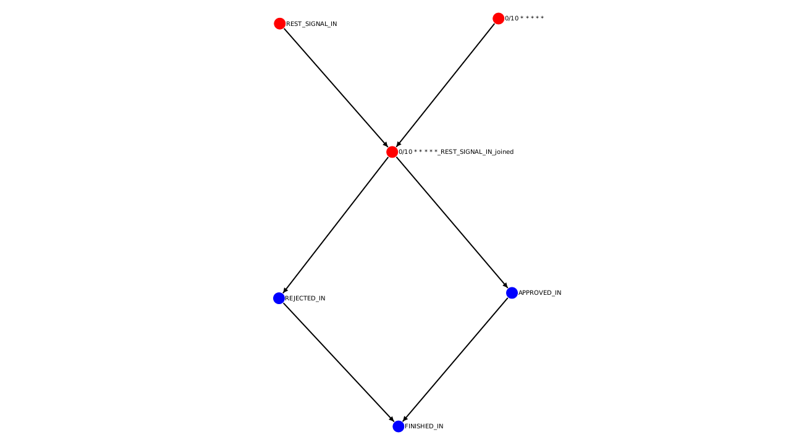
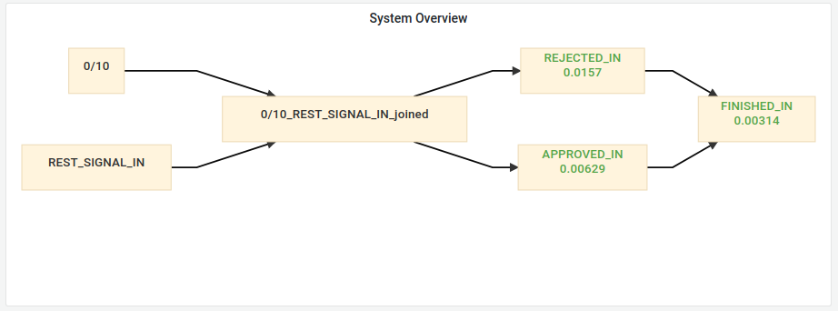

# Event Meshinery

## Table of contents

1. [Description](#Description)
2. [Motivation](#Motivation)
3. [Advantages](#Advantages)
4. [ModuleStructure](#Module-Structure)
5. [Architecture](#Architecture)
    1. [Meshinery Processors](#Processor)
    2. [Meshinery Tasks](#Task)
    3. [Data Context](#Context)
    4. [RoundRobinScheduler](#Scheduler)
    5. [Sources](#Sources)
6. [On Failure](#Failure)
    1. [Replays](#Replays)
    2. [Exception Handling](#ExceptionHandling)
7. [Logging](#Logging)
8. [Monitoring](#Monitoring)
9. [Drawing Graphs](#Draw)
    1. [Pictures](#Pictures)
    2. [Mermaid](#Mermaid)
10. [RoadMap](#RoadMap)

## Description

This framework is a state store independent event framework and designed to easily structure **long running**,
**multi step** or **long delay heavy** processing tasks in a transparent and safe way.

It is used as a way to **signal** the next processing step in your application, without untransparent code and hidden
behaviour. You describe the event and the resulting processing task, the framework will make sure that the work gets
done.

It can connect any event with any processing task and any state store, all with an **asynchronous** api to make sure
that your events are processed the moment they happen.

## Motivation 

This framework was originally written to replace KafkaStreams in a specific usecase, but you can use this framework
without Kafka. Currently supported are the following state stores, but you can easily provide your own:

Doing long running (blocking) procedures, like rest calls
via [Kafka Streams](https://kafka.apache.org/documentation/streams/) represents a challenge:

**If you block a partition with a long running call, then you cannot process any other messages from this partition
until the processing is unblocked.**

This means that you can only scale in Kafka Streams as far as your Kafka Cluster (Partition count) allows:
If your Kafka Cluster has 32 Partitions per topic, you can only have a max number of 32 running threads and can only run
32 stream processor/message processing in parallel (for this topic).

To solve this problem, the Event-Meshinery framework removes a guarantee:

**Messages in a partition are not processed in order, but processed as they arrive.**

This is possible if your events are completely independent of each other and the order of events in a single
topic/partition is not important.

## Advantages of Event-Meshinery 

* Structure your code in a really transparent way by providing a **state store independent api**, by separating the
  business layer from the underlying implementation layer. One look at a task definition tells you exactly WHAT happens
  WHEN.
* You have complete **asynchronous processing** via Java Futures without the annoying thread handling
* This framework can be integrate into any existing state store and even connect different ones: Kafka, Mysql etc.
* A simple api you are already familiar with: Consume-Process-Produce
* Fast time-to-market: switching between state stores is super easy: Start with memory for fast iteration cycles, then
  enable Kafka and/or Mysql in an agil way.
* Create a complete [event diagram](modules/meshinery-draw/draw.md) to display your events and how they interact with
  each other
* You can resume a process in case of error and you will start exactly where you left off (within bounds).
* Automatic Prometheus Monitoring integration
* Complete Spring integration. 1 Annotation starts everything, you only need to define the business logic and wire it
  together.

## Module Structure 

* [meshinery-core](modules/meshinery-core/core.md) contains, the scheduler and everything basic you need. You only need
  this to start
    * [meshinery-core-spring](modules/meshinery-core-spring/core-spring.md) contains the **Spring** AutoConfiguration
      for the core library, like starting the Scheduler automatically and providing some utility hooks
* [meshinery-monitoring](modules/meshinery-monitoring/monitoring.md) contains a prometheus monitoring solution
    * [meshinery-monitoring-spring](modules/meshinery-monitoring-spring/monitoring-spring.md) contains the **Spring**
      AutoConfiguration of the monitoring
* [meshinery-draw](modules/meshinery-draw/draw.md) contains the MeshineryDrawer class, which takes MeshineryTasks and
  draws system diagrams for multiple sources: Pictures (PNG,JPG) and Mermaid
    * [meshinery-draw-spring](modules/meshinery-draw-spring/draw-spring.md) contains a **Spring** AutoConfiguration of
      the Drawing with Endpoints
* [meshinery-connectors-mysql](modules/connectors/mysql/meshinery-mysql-connector/mysql.md) has the Mysql state store
  integration
    * [meshinery-connectors-mysql-spring](modules/connectors/mysql/meshinery-mysql-connector-spring/mysql-spring.md) has
      the Spring AutoConfiguration for Mysql
* [meshinery-connectors-kafka](modules/connectors/kafka/meshinery-kafka-connector/kafka.md) has the Kafka state store
  integration
    * [meshinery-connectors-kafka-spring](modules/connectors/kafka/meshinery-kafka-connector-spring/kafka-spring.md)
      has the Spring AutoConfiguration for Kafka

## Architecture 

[Detailed architecture documentation](modules/meshinery-core/core-architecture.md)

The general building blocks of this framework consist of 5 ideas:

* [MeshineryProcessor](#Processor)
* [MeshineryTask](#Task)
* [DataContext](#Context)
* [RoundRobinScheduler](#Scheduler)
* [Input/OutputSources](#Sources)

### Meshinery Processors 

[Detailed Documentation](modules/meshinery-core/processors.md)

Meshinery Processors define the actual business work, like doing restcalls, calculating user information etc. They take
in a DataContext and an Thread Executor and return a **CompletableFuture**.

    public class LongRunningRestcallProcessor implements MeshineryProcessor<TestContext, TestContext> {
    
        @Override
        public CompletableFuture<TestContext> processAsync(TestContext context, Executor executor) {
            return CompletableFuture.supplyAsync(() -> {
            
                  thisIsASuperLongRestCall();
                  log.info("Finished Request");
            
                  return context;
                }, executor); //running on this thread executor
        }
    }

### MeshineryTasks 

[Detailed Documentation](modules/meshinery-core/tasks.md)

A MeshineryTask describes a single **business** unit of work, which consists of an input source, a list of processors to
solve a part of the business logic and one or multiple output calls, which trigger itself other events.

An input source takes an eventkey, which gets fed to the inputsource to produce data. This data is fed to the processors
and multiple output sources, which spawn more events.

    var meshineryTask = MeshineryTask.<String, TestContext>builder()
        .read("state-a", executorService) //Input state & thread config
        .taskName("cool task name") //Task Name for logging
        .defaultOutputSource(outputSource) //Kafka connection 
        .process(processorA) //Processing step
        .write("event-b") //Event "event-b" put to Kafka topic "event-b" with the result of processorA
        .process(processorB) //Another Processing step
        .write("event-c") //Event "event-c" put to Kafka topic "event-c with the result of processorB

A task can have any amount of processors and sub processing (via processors). This allows you to include some logic on
how the pipeline should react. **The goal is that each tasks describes exactly WHAT processor and WHEN a processor is
executed.** This allows for super transparent code which allows you to argue about the execution on a higher level.

### DataContext 

[Detailed Documentation](modules/meshinery-core/datacontext.md)

A MeshineryTask defines a dataContext, which is basically just the class type in sources/processors for input and
output.

    var task = MeshineryTaskFactory.<String, TestContext>builder() //here the DataContext is TestContext
        .inputSource(inputSource) //this source can serialize TestContext
        .defaultOutputSource(defaultOutput) //this source can deserialize TestContext
        .read(INPUT_KEY, executor)
        .process(testContextProcessor) //this processor works on TestContext and adds data to it
        .write(OUTPUT_KEY); //writing the TestContext to the state store, which triggers other events

The idea here is that multiple Tasks all use the same dataContext, but enrich the data by putting their result
additively to the context. You dont need to handle millions of dtos, just 1 for each Business Case and if you add
another task at the end, you just have access to all the data which got processed in all the tasks before.

**Your state stores will have a log on how the processing went from step to step.**

### Round Robin Scheduler 

[Detailed Documentation](modules/meshinery-core/scheduler.md)

The RoundRobinScheduler takes a list of tasks, creates small "work packages" (called TaskRuns)
based on each task, and executes them on all available threads. The scheduler has alot of configurations and can run in
a continuous way or stop processing when all inputsources are exhausted.

    RoundRobinScheduler.builder()
        .task(task)
        [..]
        .backpressureLimit(100)
        .buildAndStart();

### Sources

[Detailed Documentation](modules/meshinery-core/sources.md)

There are Input and OutputSources. InputSources provide the data which gets passed to processors. OutputSources write
the data to state stores and trigger one or more new events (by the respective InputSource).

Technically there can only be a single InputSource definition on a MeshineryTask, but you can combine multiple input
sources to a single InputSource for joins for example. There can be any amount of OutputSources.

A Source describes a connection to a statestore and takes an event-key as input/output, which is passed to the state
store to read/write data to specific logically separated parts of the store. For example in Kafka an event-key would
result in a new topic, in mysql just a different column in a table. Each State Store implements the event-key lookup
differently, but you can imagine these as different states of the data.

Here "result_topic" and "input_topic" are event-keys and passed to the Source:

    var task = MeshineryTaskFactory.<String, TestContext>builder() 
        .inputSource(inputSource) //this is a kafka input source for example
        .defaultOutputSource(defaultOutput) //this is a kafka output source for example
        .read(INPUT_KEY, executor) //reading from kafka topic
        .process(testContextProcessor) //processing etc
        .write("result_topic"); //writing event to "result_topic"

Obviously, you can mix and match these sources and even write your own. They only implement a single interface function

Currently supported are the following state sources:

* [Cron](modules/meshinery-core/sources.md#utility-sources)
* [Mysql](modules/connectors/mysql/meshinery-mysql-connector/mysql.md)
* [Kafka](modules/connectors/kafka/meshinery-kafka-connector/kafka.md)
* [Memory](modules/meshinery-core/sources.md#utility-sources)

And the following Utility Source:

* [Signaling Source](modules/meshinery-core/sources.md#utility-sources)
* [InnerJoin Source](modules/meshinery-core/sources.md#utility-sources)

## On Failure 

This framework works with the at-most-once guarantee, which means that a state transition is only looked at once, since
it assumes that in case of a failure a use case specific error correction procedure needs to be called. If a processing
request results in an error and you want to resume this process, you just need to replay the message, which triggers the
processing again.

Each InputSource gives you an easy way of replaying a single event, which feeds the event back into the scheduler to
work on.

### Replays of a DataContext

The core library includes
a [TaskReplayFactory](modules/meshinery-core/src/main/java/io/github/askmeagain/meshinery/core/task/TaskReplayFactory.java)
, which allows you to "inject"
any concrete DataContext into any task, just by specifying a Taskname and providing the data as string. You can do this
for error correction or manual triggering of tasks (although a memory source would be more elegant here).

This TaskReplayFactory can run (A)synchronous and is available as an endpoint in
the [meshinery-core-spring](modules/meshinery-core-spring/core-spring.md) package.

### Exception Handling 

You can handle exceptions which happen **inside** a completable future (in a processor), by setting a new error handler.
The default behaviour is that null is returned, which will then just stop the execution of this single event, by the
RoundRobingScheduler. You can throw here hard, turn off the scheduler, do some rest/db calls and other stuff.

    var task = MeshineryTaskFactory.<String, TestContext>builder()
      [..]
      .read(KEY, executor)
      .process(new Processor())
      .exceptionHandler(exception -> {
        log.info("Error Handling"); //we add an additional log message
        return new TestContext(); //we return a new default value
      });

## Logging

This Framework already does the hard work with logging: Setting up the MDC for each thread correctly. Each log message
in **each** processor, **even in threads created by CompletableFuture.runAsync()**, you will have a correct MDC value **
automatically** of:

* "taskid" -> taskName
* "uid" -> ContextId

## Monitoring

* [Detailed Documentation](modules/meshinery-monitoring/monitoring.md)
* [Spring Integration](modules/meshinery-monitoring-spring/monitoring-spring.md)

The Monitoring package adds a basic monitoring solution. It
uses [prometheus/client_java](https://github.com/prometheus/client_java)
package to expose metrics in a format compatible with prometheus. It exposes a registry which can be used via rest (
already done in the [meshinery-monitoring-spring](modules/meshinery-monitoring-spring/monitoring-spring.md) package)
and easily expanded by your needs.

## Drawing Graphs

* [Detailed Documentation](modules/meshinery-draw/draw.md)
* [Spring Integration](modules/meshinery-draw-spring/draw-spring.md)

Since this framework provides a single way of defining tasks, we can use this to draw diagrams
via [GraphStream](https://graphstream-project.org/). These diagrams are rendered based on the actual
implementation/connection of tasks and can be styled as you wish. Such a diagram can give you an easy way to argue about
the actual topology of the application.

You can assign each task a key identifier which lets you filter and render only parts of the complete graph.

### Pictures

A picture is generated of the actual implementation.

### Mermaid.js

There is also a [Mermaid](https://mermaid-js.github.io/mermaid/#/) implementation which can be hooked
into [Jeremy Branhams Diagram panel](https://grafana.com/grafana/plugins/jdbranham-diagram-panel/)
plugin to provide a real time overview of the system and all its metrics in [Grafana](https://grafana.com/).
The [meshinery-draw-spring](modules/meshinery-draw-spring/draw-spring.md) package provides an endpoint for this, but you
can easily implement this by yourself.

## Roadmap

The following things are planned (not in order)

* Quarkus/Micronaut integration
* More Sources (Process, Sftp (Maybe), Docker)
* More efficient RoundRobinScheduler (Circular Queue)
* Sharding Possibilities in InputSources