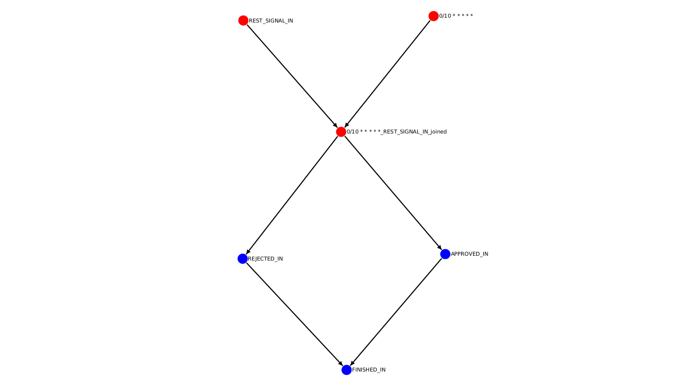

# Meshinery Drawing

    <dependency>
        <groupId>io.github.askmeagain</groupId>
        <artifactId>meshinery-draw</artifactId>
        <version>0.0.1-SNAPSHOT</version>
        <type>module</type>
    </dependency>

This framework provides you with the possibility to draw graph diagrams! Provide a list of tasks to the
MeshinaryDrawer.start() method and it returns a byte[] stream of a png. This is done
via  [GraphStream](https://graphstream-project.org/) and you can even style them by yourself.

[Css Style Reference](https://graphstream-project.org/doc/Advanced-Concepts/GraphStream-CSS-Reference/)

